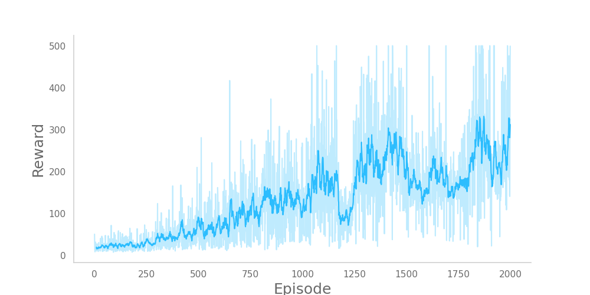

# Tensorflow and PyTorch implementation of A2C algorithm

Disclaimer! It is a work in progress project! It isn't complete.

The PyTorch implementation is currently working, but the Tensorflow version isn't.

---

You can run the [testing.py](testing.py) script to test both the algorithms.

Below the results on the CartPole environment for the PyTorch version:

